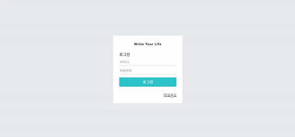

# Blog App

> 리액트를 이용한 웹페이지를 만들어보자

> 책 <리액트를 다루는 기술> 최종 프로젝트

## Preview

## Used concepts

### Frontend

- Hooks(useState, useCallback, useEffect)
- styled-component
- react-router-dom
- redux-actions, redux-saga
- quill

### Backend

- koa
- mongoose
- jwtMiddleware
- esm
